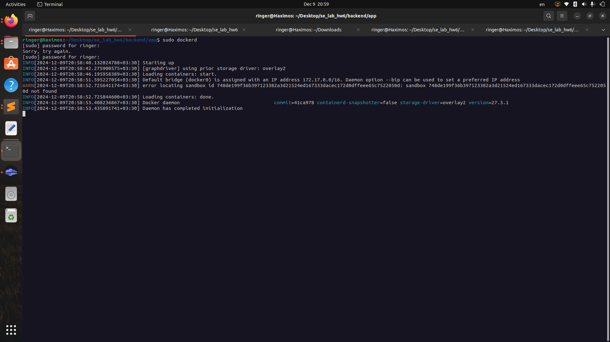

# se_lab_hw6

به نام خدا
در این آزمایش به پیاده سازی یک کد backend و سپس dockerize کردن آن میپردازیم. ساختار و کد نهایی بکند در اسکرین شات های زیر نمایش داده شده است. ساختار کلی به این صورت است که app به عنوان interface عمل می کند و درخواست های ورودی را به سرویس های user و item ارسال می کند.

اکنون داکر را راه اندازی کرده و اقدام به build و اجرا کردن imageها می کنیم:

در اینجا مشاهده می کنیم که سه سرور مد نظر بالا آمده اند (دو سرویس بکندی و یک سرور interface)

اندکی تست روی سرور اجرا می کنیم:

مشاهده می کنیم که تست ها به خوبی اجرا می شوند. اکنون دستورات docker container ls و docker image ls را اجرا می کنیم:

یک راه جهت کنترل لود بیشتر روی سرور استفاده از caching است که nginx این امکان را به ما می دهد. خط های زیر را به nginx.conf اضافه کرده و سرور را دوباره اجرا می کنیم تا از صحت عملکرد مطمئن شویم:

